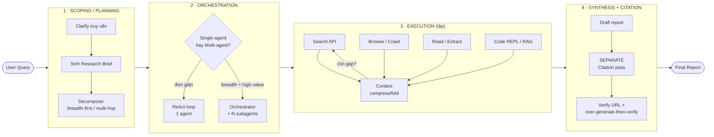
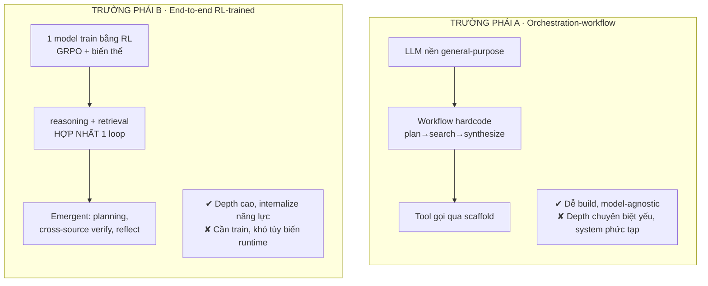
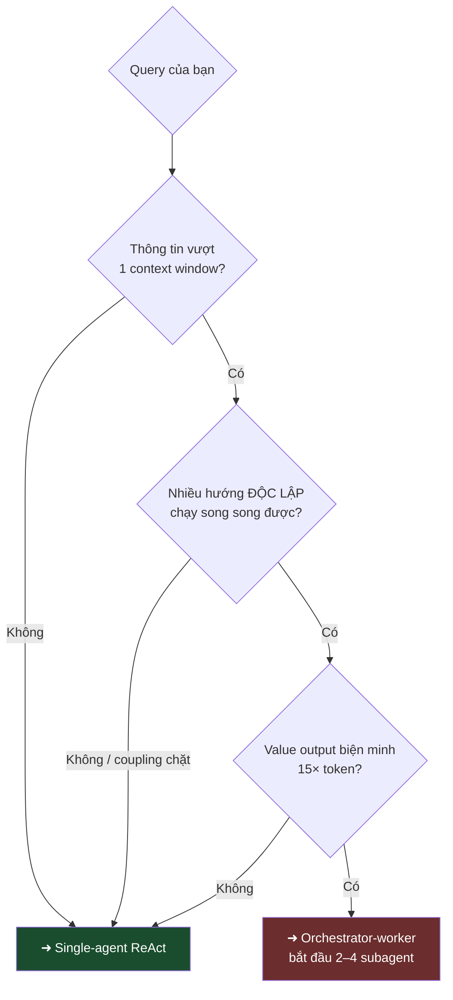
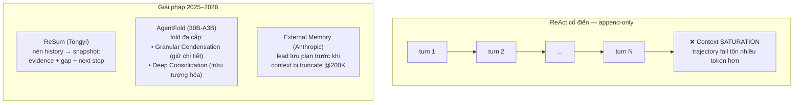
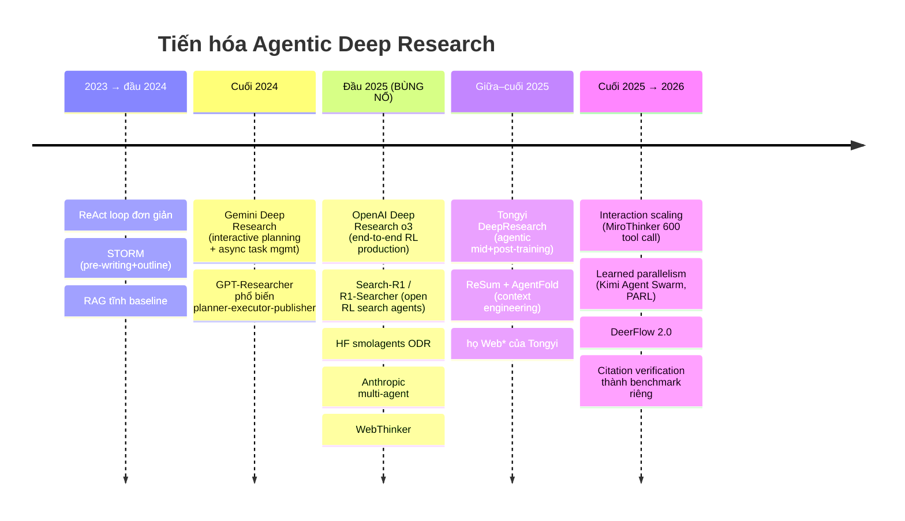
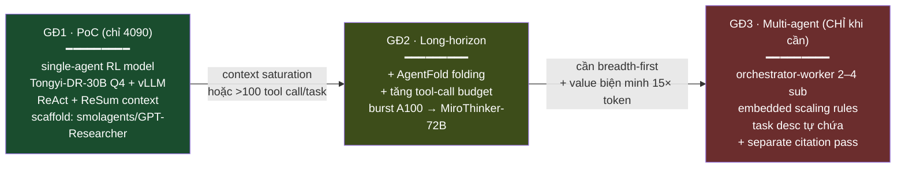

# Kiến trúc Hệ thống Agentic Deep Research

> **File 2 phần:**
> **A · CẤU TRÚC CHUẨN của PRODUCT** (authoritative — đồng bộ với `CLAUDE.md mục 3` + code `files/research/*.py`).
> **B · Bối cảnh ngành** (field-survey 2024→2026, **reference** — KHÔNG phải spec của product).
> Khi 2 phần khác nhau: **A thắng cho product; B chỉ để tham chiếu landscape.**

---

## A · CẤU TRÚC CHUẨN (PRODUCT) — *authoritative*

**Trường phái:** **Orchestration-workflow (School A)** — pipeline **deterministic · gated · auditable**. KHÔNG ReAct-tự-do, KHÔNG multi-agent. Mỗi quyết định nằm ở 1 **gate kiểm tra được** (đúng doctrine auditability) — đây là lựa chọn có chủ đích, đánh đổi "agentic-freedom" lấy **kiểm soát + audit**.

**Doctrine (bất biến):** cải thiện ở tầng **orchestration/inference** (retrieval · verify · revise-loop · prompt · evidence-selection) — **KHÔNG train model, KHÔNG build dataset**. (→ `CLAUDE.md mục 2`)

### Pipeline 5-stage (map về 4-tier canonical Phần B.1)

```
[S0 Discovery] ──Scoping──▶ [S1 Outline] ──Orchestration──▶ [S2 Investigation] ──Execution(lặp)──▶ [S3 Assemble] ──Synthesis──▶ [S4 Render]
 TopicProfile               outline emerge               per-section loop max_rounds:           book.md                   PDF
 (canonical/must-cover       TỪ evidence                 QGN→search(+tavily)→prefilter→          + math/heading            (--render)
  /out-of-scope) + P0b       (anti-matrix)               RRF+rerank→P0a gate→WRITER→             hygiene
                                                         verify(G2/G3/G4)→retry
```

| Tier canonical | Stage product | Cơ chế chuẩn |
|---|---|---|
| **1 Scoping** | S0 Discovery | TopicProfile (gemma) + canonical inject/protect (P0b) |
| **2 Orchestration** | S1 Outline | outline **emerge-từ-evidence** (anti-matrix), KHÔNG pre-template `chapters×concepts` |
| **3 Execution (lặp)** | S2 Investigation | per-section loop có gate; "còn gap → re-search" (bounded, không free-ReAct) |
| **4 Synthesis + Citation** | S2 verify (inline) + S3 Assemble | **INLINE verify-revise** (G2 per-`[N]` → writer), KHÔNG separate post-hoc citation pass |

### Đặc trưng kiến trúc chuẩn (bất biến)
- **Context model = per-section + `state.json`** → KHÔNG có 1 trajectory dài → **né context-saturation** (vấn đề Phần B.4); resume-safe · never-rewrite-accepted.
- **Verifier ≠ Writer:** grounding=HHEM · topic/cite=gemma · writer=qwen — model verify TÁCH khỏi writer (chống self-preference).
- **Gate cứng sống:** P0a domain (pre-writer ~0.40) · **G2 cite_prec ≥ 0.45** · StageD word-count · StageE topic-drift.
- **Tầng-4 faithfulness = inline verify-revise** (roadmap P1.5): feed G2 per-`[N]` verdict ngược writer để sửa đúng citation hỏng. *Gap đã biết:* **chưa có URL-resolvability check** (mảnh tầng-4 duy nhất còn thiếu so với Phần B.8).
- **LOCAL-only:** mọi model chạy cục bộ (Ollama `localhost:11434` + transformers).

> Chi tiết code-level (12 sub-stage · file:line · ngưỡng thật) → **`CLAUDE.md mục 3` + `RULES.md`** (nguồn sự thật vận hành). File này = **bản đồ kiến trúc chuẩn** (tầng cao).

---

## B · Bối cảnh ngành — *field-survey 2024 → 2026 (reference, KHÔNG phải spec product)*

> **Marker nguồn:** `[src]` = trích từ paper/blog gốc · `[2nd]` = nguồn thứ cấp/tổng hợp · `[guess]` = suy luận, chưa kiểm chứng độc lập.
> Mọi số self-reported của model 2026 (MiroThinker-1.7, Kimi K2.5, Qwen3.5/3.6) → xem mục **Caveats**.
> **Lưu ý:** phần này khảo sát LANDSCAPE để tham chiếu; các khuyến nghị model/stack ở đây **KHÔNG override** Phần A.

---

## 0. TL;DR

```
┌──────────────────────────────────────────────────────────────────────────┐
│  KIẾN TRÚC CANONICAL = pipeline 4 tầng                                      │
│                                                                            │
│   [1] SCOPING ──▶ [2] ORCHESTRATION ──▶ [3] EXECUTION ──▶ [4] SYNTHESIS    │
│   clarify+brief   single ReAct HOẶC     search/browse/    report +         │
│                   orchestrator-worker   read/code +       SEPARATE         │
│                                         context-compress  citation pass    │
│                                                                            │
│  CHIA RẼ LỚN NHẤT:                                                          │
│   • Orchestration-workflow  → hardcode pattern (GPT-Researcher, ODR, STORM) │
│   • End-to-end RL-trained    → internalize vào 1 model (Search-R1, Tongyi,  │
│                                Kimi-Researcher, MiroThinker)                │
└──────────────────────────────────────────────────────────────────────────┘
```

**Cho solo researcher (RTX 4090 24GB + A100 80GB burst):**
- Mặc định: **single-agent ReAct + context-management** trên model RL-trained mở họ Qwen (Tongyi-DeepResearch-30B-A3B / MiroThinker-30B). **KHÔNG** phải multi-agent.
- Multi-agent tốn **~15× token** so với chat `[src: Anthropic]` → chỉ đáng cho query breadth-first, high-value, parallelize được.
- Xu hướng 2026: từ "scale model/context" → **interaction scaling** (tới 600 tool call/task) + **proactive context management** (ReSum, AgentFold).

---

## 1. Pipeline canonical 4 tầng



> **Điểm yếu kiến trúc lớn nhất nằm ở tầng 4:** citation hallucination cao → luôn tách thành stage riêng.

---

## 2. Hai trường phái Orchestration (chia rẽ cốt lõi)



| Tiêu chí | A · Orchestration-workflow | B · End-to-end RL-trained |
|---|---|---|
| Ví dụ | GPT-Researcher, Open Deep Research, STORM, DeerFlow | Search-R1, Tongyi DeepResearch, Kimi-Researcher, MiroThinker |
| reasoning ↔ retrieval | Tuần tự, tách rời | Co-optimize trong 1 loop `[src]` |
| Tùy biến | Sửa workflow ở runtime | Phải re-train |
| Chi phí khởi tạo | Thấp (chỉ scaffold) | Cao (RL pipeline) |
| Phù hợp solo researcher | Khi muốn iterate nhanh | Khi dùng checkpoint mở có sẵn |

---

## 3. Single-agent vs Multi-agent (orchestrator-worker)

### 3.1 So sánh trực quan

```
SINGLE-AGENT ReAct                     MULTI-AGENT orchestrator-worker
─────────────────                      ───────────────────────────────
                                                  ┌─────────────┐
   ┌──────────┐                                   │  Lead Agent │ (Opus)
   │  Agent   │                                   │  plan→spawn │
   │ ┌──────┐ │                                   └──┬───┬───┬──┘
   │ │think │ │                            ┌─────────┘   │   └─────────┐
   │ │ ↓    │ │                            ▼             ▼             ▼
   │ │act   │ │  ──lặp──▶ answer      ┌────────┐   ┌────────┐   ┌────────┐
   │ │ ↓    │ │                       │ Sub 1  │   │ Sub 2  │   │ Sub 3  │ (Sonnet)
   │ │observe││                       │ ctx    │   │ ctx    │   │ ctx    │  ← context
   │ └──────┘ │                       │ riêng  │   │ riêng  │   │ riêng  │    ISOLATED
   └──────────┘                       └───┬────┘   └───┬────┘   └───┬────┘
                                          └────────────┼────────────┘
   chi phí ~4× chat                                    ▼
   dễ debug                                     ┌─────────────┐
   1 context window                             │CitationAgent│ ← pass riêng
                                                └─────────────┘
                                          chi phí ~15× chat · subagents KHÔNG nói chuyện nhau
```

### 3.2 Số liệu quyết định `[src: Anthropic Engineering, "How we built our multi-agent research system"]`

| Chỉ số | Giá trị | Hệ quả thiết kế |
|---|---|---|
| Multi-agent (Opus lead + Sonnet subs) vs single Opus | **+90.2%** eval nội bộ | Multi-agent thắng rõ — nhưng eval nội bộ, chưa kiểm chứng độc lập |
| Token multi-agent vs chat | **~15×** | Chỉ dùng khi value cao |
| Token single-agent vs chat | **~4×** | Default rẻ hơn ~4× lần |
| Phương sai BrowseComp giải thích bởi `token + #tool_call + model` | **95%** | Trong đó **token chiếm 80%** → "nhiều token = tốt hơn" |

### 3.3 Cây quyết định: khi nào multi-agent?



> **Anti-pattern Anthropic ghi nhận** `[src]`: spawn 50 subagent cho query đơn giản; vague task description → subagent duplicate work. Fix: embedded scaling rules + task description tự chứa.

---

## 4. Memory & Context Management (trục đổi mới nóng nhất 2025–2026)



| Kỹ thuật | Cơ chế | Kết quả nổi bật |
|---|---|---|
| **ReSum** `[src: Tongyi]` | Nén định kỳ thành context snapshot; `ReSumTool-30B` (trên Qwen3-30B-A3B-Thinking); train `ReSum-GRPO` | "Indefinite exploration" trong context cố định |
| **AgentFold** `[src]` | Agent = "self-aware knowledge manager"; fold đa cấp | AgentFold-30B-A3B **vượt DeepSeek-V3.1-671B** dù nhỏ ~20× |
| **External Memory** `[src: Anthropic]` | Ghi plan ra store trước truncate @200K token | Sống sót qua context dài |
| **Gemini RAG-continuity** `[2nd]` | 1M context + RAG | Follow-up qua hàng trăm trang |

---

## 5. Bảng tham chiếu hệ thống (open-source trước)

| Hệ thống | Pattern | Điểm mới | Backbone | License |
|---|---|---|---|---|
| **GPT-Researcher** | planner-executor-publisher, parallel sub-Q | "parallelization over synchronization"; report 2k+ từ, 20+ nguồn | STRATEGIC + SMART LLM | MIT |
| **Open Deep Research** (LangChain) | supervisor-researcher; scoping→research→report | LangGraph StateGraph, MCP; **#6 Deep Research Bench, RACE 0.4344** `[src]` | model-agnostic | MIT |
| **HF Open Deep Research** (smolagents) | manager CodeAgent + managed web agent | **code-as-action** (~30% ít bước hơn); **55.15% GAIA val** vs **33% JSON-based** `[src]` | o1 default | Apache-2.0 |
| **STORM** (Stanford) | pre-writing (perspective QA) → outline writing | multi-perspective; **~85% citation recall** | DSPy | open |
| **DeerFlow** (ByteDance) | hierarchical supervisor → Researcher/Coder/Reporter | LangGraph + sandbox; 2.0 progressive skills | multi-provider | MIT |
| **WebThinker** | LRM-native: Deep Web Explorer + Think-Search-Draft | interleaved drafting; iterative online DPO; NeurIPS 2025 | QwQ-32B | open |
| **Search-R1** | 1 model, RL co-optimize reasoning+retrieval | special token search/answer; **+41% (7B), +20% (3B) over RAG** `[src]` | Qwen2.5, Llama3.2 | open |
| **Tongyi DeepResearch** | end-to-end agentic RL (mid + post-training) | 30.5B total / **3.3B active**; SOTA (xem mục 6) | Qwen3-30B-A3B | open |
| **MiroThinker v1.0/1.7** | interaction scaling | **256K ctx, tới 600 tool call/task** | 8B/30B/72B | open |
| **Kimi-Researcher** | end-to-end agentic RL | 70+ query/trajectory; fully async rollout; turn-level partial rollout | Kimi internal | closed |

### Hệ thương mại (đối chiếu)

| Hệ thống | Kiến trúc | Đặc trưng |
|---|---|---|
| **OpenAI Deep Research** | single o3 fine-tuned, end-to-end RL; async task mgmt | học plan/execute/backtrack qua RL; web + Python + MCP + file search `[src: OpenAI docs]` |
| **Gemini Deep Research** | single-agent RL; **interactive planning** (user duyệt blueprint) | async task manager; 1M ctx + RAG; hard 60-min limit |
| **Perplexity Deep Research** | iterative ReAct retrieval loop | BM25 + dense rerank (Sonar); vd: 1 query → 21 search, 193K reasoning token |
| **Anthropic Claude Research** | **orchestrator-worker multi-agent** | lead + parallel isolated subagent + separate citation; **+90.2%**, ~15× token |
| **Grok DeepSearch** | DR agent + real-time web | phân rã query → subtask |

---

## 6. Benchmark chủ chốt — số liệu & ý nghĩa kiến trúc

### 6.1 Số SOTA open-source `[src: technical reports]`

```
Tongyi DeepResearch-30B-A3B (arXiv 2510.24701):
  HLE 32.9 │ BrowseComp 43.4 │ BrowseComp-ZH 46.7 │ WebWalkerQA 72.2
  GAIA 70.9 │ xbench-DeepSearch 75.0 │ FRAMES 90.6
  → vượt OpenAI-o3 và DeepSeek-V3.1 trên nhiều mục

MiroThinker v1.0-72B (arXiv 2511.11793, 13/11/2025):
  GAIA 81.9 │ HLE 37.7 │ BrowseComp 47.1 │ BrowseComp-ZH 55.6
  256K context · tới 600 tool call/task · vượt MiniMax-M2 +6.2 trên GAIA
```

### 6.2 Mỗi benchmark "soi" thành phần kiến trúc nào

| Benchmark | Quy mô | Soi năng lực |
|---|---|---|
| **GAIA** | L1–L3 | tool-use + multi-step orchestration tổng quát |
| **BrowseComp** | 1,266 câu | persistence/breadth — **nhạy token budget** |
| **BrowseComp-ZH** | 289 câu, 11 domain | multilingual/Chinese web — nơi Qwen/Tongyi/MiroThinker trội |
| **HLE** | subset 2,158 text-only | reasoning nội tại (không search ra được) |
| **DeepResearch Bench / DRBench** | RACE + FACT | synthesis (RACE) + citation accuracy (FACT) |

> **FACT citation accuracy** `[src: DRBench]`: từ **78% (OpenAI DR)** đến **94% (Claude with search)**.

---

## 7. Tiến hóa kiến trúc theo thời gian



**Bốn trục cải tiến chính:**

```
① TEST-TIME SCALING    → token 80% phương sai BrowseComp → nhiều tool call + ctx = tốt hơn
② RL SHAPES ARCH       → end-to-end RL hợp nhất reasoning+retrieval 1 loop; emergent behavior
③ LONG-HORIZON         → từ <100 → 600 tool call; async + turn-level partial rollout (Kimi)
④ ASYNC/PARALLEL COORD → orchestrator-worker đổi ~15× token lấy parallelism; coordination fragile
```

---

## 8. Quyết định cho solo researcher — RTX 4090 24GB + A100 80GB burst

### 8.1 Model nào fit phần cứng

| Phần cứng | Chạy được | Lưu ý `[guess]`/`[2nd]` |
|---|---|---|
| **RTX 4090 24GB** | Qwen3-30B-A3B class (Tongyi-DR-30B, MiroThinker-30B, AgentFold-30B) @ Q4 (~19–21GB) | **Known Ollama GPU-util issue với MoE** (GitHub #10458) → dùng **vLLM** hoặc llama.cpp `--n-cpu-moe`. Họ Qwen hỗ trợ 119+ ngôn ngữ (mạnh VN/ZH) |
| **A100 80GB burst** | MiroThinker-72B, context 256K, LoRA/GRPO fine-tune nhẹ | Burst khi cần BrowseComp-class hoặc context dài |

### 8.2 Lộ trình 3 giai đoạn



### 8.3 Stack khuyến nghị (xuyên suốt)

```
┌─ MODEL ──────────── Tongyi-DR-30B-A3B / MiroThinker-30B (RL-trained, internalize)
├─ ORCHESTRATION ──── smolagents CodeAgent (code-as-action) HOẶC GPT-Researcher
├─ SEARCH ─────────── Tavily / SerpApi / Serper
├─ BROWSE ─────────── text-based browser + text inspector
├─ RETRIEVAL ──────── vector store nội bộ (RAG domain) — Qdrant/BGE-M3
├─ CONTEXT MGMT ───── ReSum (GĐ1) → AgentFold (GĐ2)
└─ VERIFY ─────────── SEPARATE citation pass + check URL resolvability  ← BẮT BUỘC
```

> **Nguyên tắc gốc:** dùng giải pháp đơn giản nhất chạy được; chỉ tăng complexity khi **đo được** cải thiện. Single-agent rẻ hơn ~4×, dễ debug — đừng nhảy thẳng multi-agent.

---

## 9. Caveats (đọc trước khi cam kết kiến trúc)

| # | Cảnh báo |
|---|---|
| 1 | Nhiều số (Anthropic +90.2% eval nội bộ; self-reported MiroThinker-1.7, Kimi K2.5, Qwen3.5/3.6) **chưa kiểm chứng độc lập**; **benchmark contamination** là rủi ro thực `[guess]` |
| 2 | Hệ 2026 (Qwen3.5/3.6, DeerFlow 2.0, MiroThinker-1.7) phát triển rất nhanh; nhiều số từ vendor/press, **không peer-reviewed** |
| 3 | "55.15% vs 67.36%" GAIA (HF vs OpenAI) là **pass@1 validation**; OpenAI 72.57% với consensus@64 — **không so sánh trực tiếp được**, private test set ẩn |
| 4 | Phân biệt **established** (ReAct, plan-execute, orchestrator-worker, RL co-optimization — nhiều replication) vs **emerging** (interaction scaling, learned parallelism/Agent Swarm, proactive folding — mới, ít replication độc lập) |
| 5 | Ollama có **known issue GPU util với Qwen 30B-A3B MoE** → test vLLM/llama.cpp **trước** khi cam kết. Đo VRAM/throughput trên **prompt thật của bạn**, không tin vendor number |
| 6 | Citation hallucination: **3–13% URL hallucinate**, **5–18% non-resolving**, tới **57% citation post-rationalized** trong RAG output `[src: arXiv 2604.03173]` → đây là lý do tách citation pass là bắt buộc |

---

## Nguồn chính

- Anthropic Engineering — *How we built our multi-agent research system* `[src]`
- Tongyi DeepResearch Technical Report — arXiv 2510.24701 `[src]`
- MiroThinker Technical Report — arXiv 2511.11793 `[src]`
- *From Web Search towards Agentic Deep Research* (survey) — arXiv 2506.18959 `[src]`
- *Detecting and Correcting Reference Hallucinations...* — arXiv 2604.03173 `[src]`
- *Context Engineering 2.0* — arXiv 2510.26493 `[2nd]`
- Hugging Face — *Open-source DeepResearch* blog + smolagents repo `[src]`
- LangChain — Open Deep Research (Deep Research Bench leaderboard) `[src]`
- ByteByteGo — *How OpenAI, Gemini, and Claude Use Agents...* `[2nd]`
